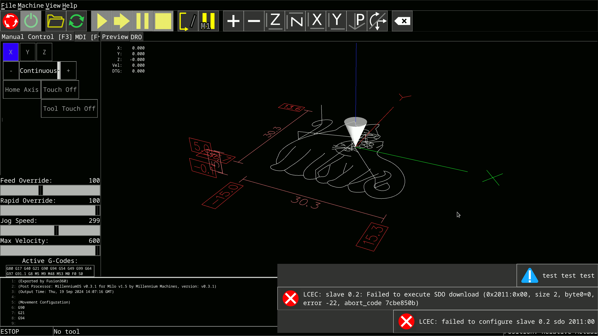

# ofa-mod
Oled Friendly Axis Mod

This is LinuxCNC AXIS interface mod.



### Features:
* Automatic selection of scale and font size
* Randomizing window position to avoid oled burn-in

### Installation
* Place this script in the folder of your choice. (for example to linuxcnc config folder)
* Tune your ini file like this:

```
[DISPLAY]
DISPLAY = axis
USER_COMMAND_FILE=/home/sova/Desktop/ofa_mod.py

#SCALE = 1.0
#FULLSCREEN=1
#FONT_SIZE=10
#FONT_NAME=Mono
#BACKGROUND=grey20
#BACKGROUND2=grey30
## e.t.c
```

In addition, you can use this utility to dim the external display after a period of inactivity: https://github.com/jD91mZM2/xidlehook

Example
```
#!/usr/bin/env bash

export PRIMARY_DISPLAY="$(xrandr --listactivemonitors | awk '/x/{print $4}')"

xidlehook \
  `# Dim the screen after 60 seconds, undim if user becomes active` \
  --timer 60 \
    'xrandr --output "$PRIMARY_DISPLAY" --brightness 0.5' \
    'xrandr --output "$PRIMARY_DISPLAY" --brightness 1.0' \
  --timer 300 \
    'xrandr --output "$PRIMARY_DISPLAY" --brightness 0.25' \
    'xrandr --output "$PRIMARY_DISPLAY" --brightness 1.0' \
```
